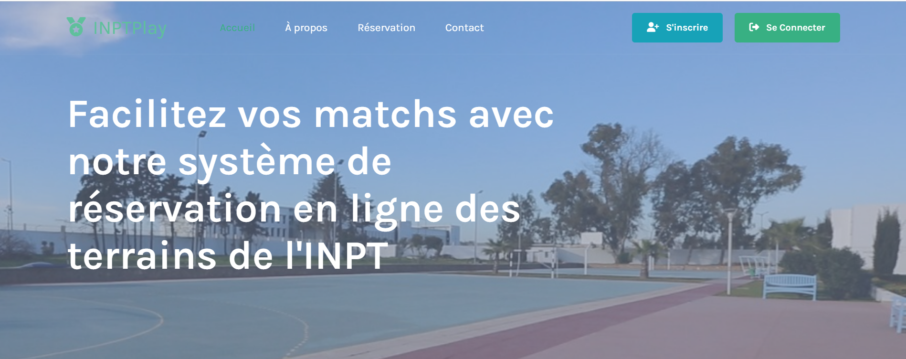

# INPTPlay - Réservation de Terrains Sportifs

INPTPlay est une application web permettant aux étudiants de l'INPT de réserver facilement des terrains de sport, incluant le football, le basketball et le volleyball. L'application offre une interface utilisateur intuitive pour gérer les réservations, annuler des créneaux, et améliorer l'accès aux installations sportives de l'université.

## Fonctionnalités

- Réservation en ligne des terrains de football, basketball et volleyball
- Interface utilisateur conviviale et réactive
- Gestion des créneaux horaires disponibles et réservés
- Annulation des réservations
- Section de suggestions pour améliorer les services

## Technologies Utilisées

- **Frontend**: HTML, CSS, JavaScript, Bootstrap
- **Backend**: Java (JSP, Servlets)
- **Base de Données**: MySQL
- **Gestion des Dépendances**: Maven

# Fonctionnalités de INPTPlay

INPTPlay est une application web qui permet aux étudiants de l'INPT de réserver facilement des terrains de sport. Voici une description des principales fonctionnalités de l'application :

## 1. Page d'Accueil

La page d'accueil présente une vue d'ensemble de l'application et de ses fonctionnalités. Les utilisateurs peuvent accéder à différentes sections depuis le menu de navigation.

**Capture d'écran : Page d'Accueil**

## 2. Inscription et Connexion

Les utilisateurs peuvent créer un compte et se connecter pour accéder aux fonctionnalités de réservation.

- **Inscription** : Les nouveaux utilisateurs peuvent créer un compte en fournissant leur nom, email, mot de passe et autres informations nécessaires.
- **Connexion** : Les utilisateurs existants peuvent se connecter en utilisant leur nom d'utilisateur et mot de passe.

**Capture d'écran : Page d'Inscription**

**Capture d'écran : Page de Connexion**

## 3. Réservation de Terrains

Les utilisateurs peuvent réserver des terrains de football, basketball et volleyball en sélectionnant la date, l'heure et le type de sport. Les créneaux disponibles et réservés sont clairement affichés.

**Capture d'écran : Page de Réservation**

## 4. Gestion des Réservations

Les utilisateurs peuvent consulter leurs réservations actuelles et annuler celles qu'ils ne peuvent plus honorer.

**Capture d'écran : Page de Gestion des Réservations**

## 5. Section de Suggestions

Une section est dédiée aux suggestions des utilisateurs pour améliorer les services offerts. Les utilisateurs peuvent soumettre leurs idées et commentaires.

**Capture d'écran : Page de Suggestions**

## 6. Contact

Une page de contact est disponible pour que les utilisateurs puissent obtenir de l'aide ou poser des questions. Les informations de contact et un formulaire sont fournis.

**Capture d'écran : Page de Contact**

## 7. Footer

Le footer de l'application contient des liens utiles, des informations de contact et des liens vers les réseaux sociaux.

**Capture d'écran : Footer**

---

**Remarque** : Remplacez `path/to/...` par le chemin d'accès réel aux captures d'écran que vous souhaitez afficher dans chaque section. Vous pouvez télécharger vos images dans le dépôt GitHub et utiliser le chemin relatif ou un lien direct vers l'image hébergée.

